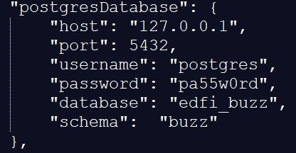
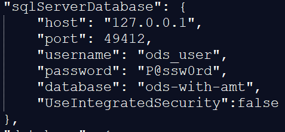
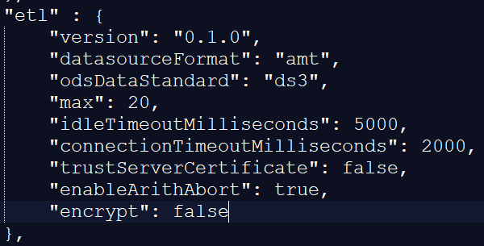
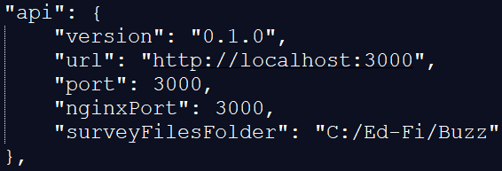

# Project Buzz Installer

These scripts were made possible thanks to the Ed-Fi Alliance and the Michael and Susan Dell Foundation.

## Description

The installation script downloads all the assets needed for the Ed-Fi Buzz. Artifacts are placed in the dist/ directory at the root of this project

It validates existence of NuGet Package Provider, Node JS, IIS, SQL Server and Postgres. Retrieves the latest release of several Ed-Fi Buzz NuGet packages. Downloads prequisites from the web.

The ETL requires a default, local instance of SQL Server, and the user executing the script must have sufficient permissions. Any existing Buzz databases on the build server should be backed-up and removed before running this build script.

## Installation
- **Database:** This application provides the scripts to create the database structures necessary to execute Ed-Fi Buzz.
- **ETL:** This application provides two ETL modules to load Google Form Survey data to the Buzz database, and to port data from the ODS data sources to Postgres.
- **API:** GraphQL-based API for supporting the Ed-Fi Buzz solution.
- **UI:** Project Buzz Web Application..

## Prerequisites
We recommend that the following prerequisites are installed on the machine that you are going to run the scripts on.

1. Node Js LTS version https://nodejs.org/en/
2. Postgresql

## Setup Instructions
1. Edit the configuration file to include the values according to your installation environment.
2. Run as administrator the installation script

### Configuration file

The configuration variables for the installation are in the **'Windows\configuration.json'** file. In this file you can update the values to adapt them before the installation.

The variables that can be configured are detailed below.

#### General configuration

- **idProvider:** Authentication provider. Valid values: google, adfs.
- **googleClientId:** If the authentication provider is google, you must set in this field the corresponding googleClientId when you created the Web Application in Google Developers Console.
- **adfsClientId:** If the authentication is validated using adfs, you must inclute the clientId.
- **adfsTenantId:** If the authentication is validated using adfs, you must inclute the adfsTenantId.
- **keepSurveysSynch:** Set this value to true if you want the Buzz app surveys syncronized with ODS surveys.

#### postgresDatabase

You need to update the Postgres database connection string according to your configuration. You can configure the server, credentials or name to connect to the postgres database.

- **host:** Database server.
- **port:** Postgres port (E.g. 5432)
- **username:** User to connect to the database
- **password:** Password to connect to the database
- **database:** Database name. (e.g. "edfi_buzz")

#### sqlServerDatabase

You can configure the server, credentials or name to connect to the Sql Server ODS database.

- **host:** Sql Server name or IP.
- **port:** SQL database port.
- **username:** SQL Server database user name.
- **password:** SQL Server database.
- **database:** ODS database. AMT must be installed in this database.
- **UseIntegratedSecurity:** If you use integrated security. Allowed values: true, false.

#### etl

Options to configure the ETL to load from the database or file to the postgres database.

- **datasourceFormat:** If the data source corresponds to the Analytics Middle Tier (amt) or direct views of the ODS tables. Allowed values: amt, ods.
- **odsDataStandard:** Database standard to use, if it is Data Standard 2 or 3.x. Allowed values: ds2, ds3.

#### api

- **version:** The NuGet version to download. Blank gets latest.
- **url:**  URL for the GraphQL endpoint setting in the UI env file.
- **port:** API port.

#### ui

- **version:** The NuGet version to download. Blank gets latest.
- **port:** Port to access UI.
- **externalLogo:** If true, look for images in an external URL. If false, the images must have been copied into the 'assets' folder of the UI. 
- **logo:** Login page logo URL.
- **logoWidth:** Logo max width.
- **title:** Site title.
- **titleLogo:** Site logo title to display in header URL.
- **titleLogoWidth:** Site logo title max width.
- **titleLogoHeight:** Site logo max height.

#### Change UI Web App icon (fav.ico)
To update the icon displayed in the browser, it is required to replace the fav.ico file with a valid icon file. You must copy the fav.ico that you want to use in the web application, in the public folder (**C:\Ed-Fi\Buzz\UI\nginx-1.19.0\build\fav.ico**).

### Installation
Installation script requirements:
- A non-core PowerShell. 
- $PSVersionTable.PSEdition is Desktop
- Run as Administrator. It requires administrator privileges.
- Configuration file. It receives the configPath Full path to a JSON document containing configuration settings for Buzz. Defaults to **.\configuration.json** in the same directory.

- The script will not run on PowerShell Core because WebAdministration does not load properly.

The installation script must be run in PowerShell as an administrator.

## Developer READMEs

Developer information for each Project Buzz application is outlined in a README within their respective root folders. The READMEs contain instructions for running the applications for debugging, or other tasks.

* [API - Developer README](../../EdFi.Buzz.Api/README.md)
* [Database -  Developer README](../../EdFi.Buzz.Database/README.md)
* [ETL -  Developer README](../../EdFi.Buzz.Etl/README.md)
* [User Interface -  Developer README](../../EdFi.Buzz.UI/README.md)

## Legal Information

Copyright (c) 2020 Ed-Fi Alliance, LLC and contributors.

Licensed under the [Apache License, Version 2.0](../../LICENSE) (the "License").

Unless required by applicable law or agreed to in writing, software
distributed under the License is distributed on an "AS IS" BASIS,
WITHOUT WARRANTIES OR CONDITIONS OF ANY KIND, either express or implied.
See the License for the specific language governing permissions and
limitations under the License.

See [NOTICES](../../NOTICES.md) for additional copyright and license notifications.
