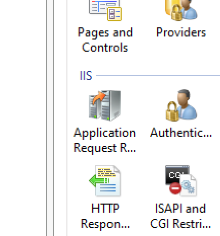
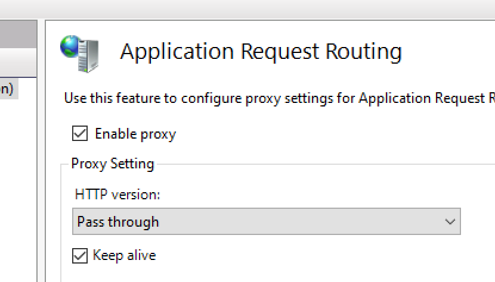

# Project Buzz Installer

These scripts were made possible thanks to the Ed-Fi Alliance and the Michael and Susan Dell Foundation.

## Description

The installation script downloads all the assets needed for the Ed-Fi Buzz. Artifacts are placed in the dist/ directory at the root of this project

It validates existence of NuGet Package Provider, Node JS, IIS, SQL Server and Postgres. Retrieves the latest release of several Ed-Fi Buzz NuGet packages. Downloads prerequisites from the web.

The ETL requires a default, local instance of SQL Server, and the user executing the script must have sufficient permissions. Any existing Buzz databases on the build server should be backed-up and removed before running this build script.

## Installation

- **Database:** This application provides the scripts to create the database structures necessary to execute Ed-Fi Buzz.
- **ETL:** This application provides two ETL modules to load Google Form Survey data to the Buzz database, and to port data from the ODS data sources to Postgres.
- **API:** GraphQL-based API for supporting the Ed-Fi Buzz solution.
- **UI:** Project Buzz Web Application..

## Prerequisites

We recommend that the following prerequisites are installed on the machine that you are going to run the scripts on.

- Node Js LTS version https://nodejs.org/en/
- Postgresql
- IIS with the [Application Request Routing](https://www.iis.net/downloads/microsoft/application-request-routing) and [URL Rewrite](https://www.iis.net/downloads/microsoft/url-rewrite) modules, installed and configured per the documentation to provide request routing.
- [dotnet runtime 3.1.9](https://dotnet.microsoft.com/download/dotnet-core/thank-you/runtime-3.1.9-windows-x64-installer) is used by the Windows Service Wrapper ([winsw](https://github.com/winsw/winsw/))
- The [IIS URL Rewrite Module version 2.1](https://www.iis.net/downloads/microsoft/url-rewrite) provides routing for both IIS websites to support React as a single-page application (SPA) and for API's reverse proxy routes.
- [Application Request Routing version 3.0](https://www.microsoft.com/en-us/download/details.aspx?id=47333) is used by the API site for configuring reverse proxy routes in IIS.

## Setup Instructions

- Choose a drive and root directory location. For our purposes, `D:\Ed-Fi\Buzz` will be used in examples.
- Create an empty directory`D:\Ed-Fi\UI\build`. We will map an IIS website to this directory as the Buzz UI.
- Create an empty directory `D:\Ed-Fi\API-Redirect` for the reverse proxy rules. We will point the IIS API site to this directory, and later install redirection rules in a web.config. This will be the Buz API endpoint.
- Download the NuGet package edfi.buzz from the [Ed-Fi Azure Artifact Repository](https://dev.azure.com/ed-fi-alliance/Ed-Fi-Alliance-OSS/_packaging?_a=feed&feed=EdFi%40Local)r
- Rename the file's extension from `.nupkg` to `.zip`.
- Expand the edfi.buzz zip package to a temporary location - `C:\temp\edfi`, for example.
- Create a `Buzz` website in IIS using `D:\Ed-Fi\Buzz\UI`. See the `IIS Web site` section below.
- Configure SSL bindings, apply a certificate and port bindings. The Buzz UI web site would be installed to D:\Ed-Fi\Buzz\UI\build. Note the port (if other than https 443), and the location for the configuration (if different than the example) in step 2.
- Create another SSL bound website called `Buzz-Api` for the Buzz API. Point  the folder contents to the empty `D:\Ed-Fi\Buzz\API-Redirect` folder. (The install will create a single web.config file to redirect calls to the locally hosted API service endpoint)
- Repeat the SSL binding step to apply SSL certificates and ports for the `Buzz-API` website.
- In the Application Request Routing module settings, ensure that `Enable proxy` is checked.


- Open PowerShell console as an Administrator.
-Set your current location to the edfi-buzz's `eng\Windows` directory.
- Make a copy the `example.configuration.json` file and renamed it to `configuration.json`.
- See the `General configuration` section for editing the `configuration.json` file to include the values according to your installation environment.

## IIS Web site

Create a website for IIS per your internal procedures. For the configuration, note the install location and port. Configure the ARR and URL Rewrite modules for IIS from the link above. The installation will include a web.config to set up routes within the UI React application.


### Configuration file

The configuration variables for the installation are in the **'Windows\configuration.json'** file. In this file you can update the values to adapt them before the installation.


The variables that can be configured are detailed below. Note that the version values are repeated for each Buzz application, and should be null to get the latest value.

#### General configuration

- **includePrerelease:** When true, allows NuGet to include pre-release NuGet packages as latest version. Recommended setting: false.
- **installPath:** The folder where Buzz apps are installed (C:\Ed-Fi\Buzz)
- **toolsPath:** The folder where Buzz downloads helper NuGet packages. (C:\temp\tools)
- **packagesPath:** The folder where Buzz downloads NuGet packages. (C:\temp\tools)
- **artifactRepo:** The NuGet repository URI (https://pkgs.dev.azure.com/ed-fi-alliance/Ed-Fi-Alliance-OSS/_packaging/EdFi/nuget/v3/index.json)
- **install[Database|Etl|Ui|Api]:** skips installation for apps marked false.
- **idProvider:** Authentication provider. Valid values: google, adfs.
- **googleClientId:** If the authentication provider is google, you must set in this field the corresponding googleClientId when you created the Web Application in Google Developers Console.
- **adfsClientId:** If the authentication is validated using adfs, you must include the clientId.
- **adfsTenantId:** If the authentication is validated using adfs, you must include the adfsTenantId.
- **loadSampleData:** Set to false in production; is for test purposes only.
- **keepSurveysSynch:** Set this value to true if you want the Buzz app surveys synchronized with ODS surveys.

#### postgresDatabase

You need to update the Postgres database connection string according to your configuration. You can configure the server, credentials or name to connect to the postgres database.

- **host:** Database server host name.
- **port:** Postgres port (E.g. 5432)
- **username:** User to connect to the database
- **password:** Password to connect to the database
- **database:** Database name. (e.g. "edfi_buzz")

#### sqlServerDatabase

You can configure the server, credentials or name to connect to the Sql Server ODS database.

- **host:** Sql Server name or IP.
- **port:** SQL database port.
- **username:** SQL Server database user name.
- **password:** SQL Server database.
- **database:** ODS database. AMT must be installed in this database.
- **UseIntegratedSecurity:** If you use integrated security. Allowed values: true, false.

#### etl

Options to configure the ETL to load from the database or file to the postgres database.

- **version:** The NuGet version to download. Blank gets latest.
- **datasourceFormat:** If the data source corresponds to the Analytics Middle Tier (amt) or direct views of the ODS tables. Allowed values: amt, ods.

#### api

- **version:** The NuGet version to download. Blank gets latest.
- **url:**  URL for the GraphQL endpoint setting in the UI env file.
- **port:** API port.
- **surveyFilesFolder** The folder into which uploaded survey files are written
- **corsOrigins** This is a comma-delimited list of URIs which require API access. CORS policy will reject any URIs not in this list. Include the protocol (http or https).
- **rejectTlsUnauthorized** true/false value to bypass the server certificate validation callback.
- **extraCaCerts** Comma-delimited list of file system paths to your organization's root CA certificates for that server. Export from your certificate store.

#### ui

- **version:** The NuGet version to download. Blank gets latest.
- **url:** Used to test the status code returned from the IIS configured Buzz UI website at the end of the install.
- **graphQlEndpoint:** The URI that the Buzz UI and users can use to access the API.
- **externalLogo:** If true, look for images in an external URL. If false, the images must have been copied into the 'assets' folder of the UI.
- **logo:** Login page logo URL.
- **logoWidth:** Logo max width with CSS size units ("25px").
- **title:** Site title.
- **titleLogo:** Site logo title to display in header URL.
- **titleLogoWidth:** Site logo title max width with CSS size units ("78px").
- **titleLogoHeight:** Site logo max height with CSS size units ("350px").

#### Change Privacy Policy page 
The privacy policy is included as a Markdown file and can be customized on the installed site.

To include a customized privacy policy page, you can replace the content of the **PRIVACY.POLICY.md** file with the content of your privacy policy. The file is in the web application folder (**C:\Ed-Fi\Buzz\UI\build\PRIVACY.POLICY.md**).


#### Change UI Web App icon (fav.ico)
To update the icon displayed in the browser, it is required to replace the fav.ico file with a valid icon file. You must copy the fav.ico that you want to use in the web application, in the public folder (**C:\Ed-Fi\Buzz\UI\build\fav.ico**).


### Installation

Installation script requirements:

- A non-core PowerShell.
- $PSVersionTable.PSEdition is Desktop

```powershell
C:\temp\edfi-buzz.1.0.0.384\eng\Windows> $PSVersionTable

Name                           Value
----                           -----
PSVersion                      5.1.19041.610
PSEdition                      Desktop
PSCompatibleVersions           {1.0, 2.0, 3.0, 4.0...}
BuildVersion                   10.0.19041.610
CLRVersion                     4.0.30319.42000
WSManStackVersion              3.0
PSRemotingProtocolVersion      2.3
SerializationVersion           1.1.0.1

```

- Run as Administrator. It requires administrator privileges.
- Set the execution policy to Bypass for the duration of the PowerShell session.

```powershell
Set-ExecutionPolicy -Scope Process -ExecutionPolicy Bypass
```

- Execute the install.ps1 script. If the configuration.json file is in the same folder, then

```powershell
C:\temp\edfi-buzz.1.0.0.384\eng\Windows> .\install.ps1
```

- Configuration file. It receives the configPath Full path to a JSON document containing configuration settings for Buzz. Defaults to **.\configuration.json** in the same directory.


- The script will not run on PowerShell Core because WebAdministration does not load properly.

The installation script must be run in PowerShell as an administrator.


- After a successful install, you should see that all Service applications are in a Running state, and web sites return HTTP status 200.

```powershell
Checking Ed-Fi Buzz App Services and Webs statuses ...

Name                           Value
----                           -----
Ed-Fi Buzz UI Website          Status code returned: 200
Ed-Fi Buzz API Service         Running
Ed-Fi Buzz ETL Service         Running
Ed-Fi Buzz API Website         Status code returned: 200


Ed-Fi Buzz installation complete.
```
- Confirm that the Windows Service Host has two Ed-Fi services for the ETL and API.


## Developer READMEs

Developer information for each Project Buzz application is outlined in a README within their respective root folders. The READMEs contain instructions for running the applications for debugging, or other tasks.

* [API - Developer README](../../EdFi.Buzz.Api/README.md)
* [Database -  Developer README](../../EdFi.Buzz.Database/README.md)
* [ETL -  Developer README](../../EdFi.Buzz.Etl/README.md)
* [User Interface -  Developer README](../../EdFi.Buzz.UI/README.md)


## Common Problems
##### 1. Installation fails with this error:
**Please verify all your online package sources are available (OR) package id, version are specified correctly:**

```powershell
Downloading the package for Buzz Database application ...
Install-EdFiPackage installing  edfi.buzz.database...
D:\temp\tools\nuget install edfi.buzz.database -source EdFi -version 0.1.0-pre0123 -outputDirectory D:\temp\packages -prerelease
Package 'edfi.buzz.database 0.1.0-pre0123' is not found in the following primary source(s): 'C:\WINDOWS\system32\config\systemprofile\.nuget\packages\,https://pkgs.dev.azure.com/ed-fi-alliance/Ed-Fi-Alliance-OSS/_packaging/EdFi/nuget/v3/index.json'. Please verify all your online package sources are available (OR) package id, version are specified correctly.
Ed-Fi Buzz installation failed.
Finished Buzz install..
```
##### Solution
**1. Clear All Nuget Cache(s)**
To do this, follow the instructions in this link [Clearing local folders](https://docs.microsoft.com/en-us/nuget/consume-packages/managing-the-global-packages-and-cache-folders#clearing-local-folders).

**2. Wait 10 minutes and try again.**
If the first option doesn't work. just try waiting 10 minutes. The packages take some time, after they have been deployed, to actually be available. 


## Legal Information

Copyright (c) 2020 Ed-Fi Alliance, LLC and contributors.

Licensed under the [Apache License, Version 2.0](../../LICENSE) (the "License").

Unless required by applicable law or agreed to in writing, software
distributed under the License is distributed on an "AS IS" BASIS,
WITHOUT WARRANTIES OR CONDITIONS OF ANY KIND, either express or implied.
See the License for the specific language governing permissions and
limitations under the License.

See [NOTICES](../../NOTICES.md) for additional copyright and license notifications.
